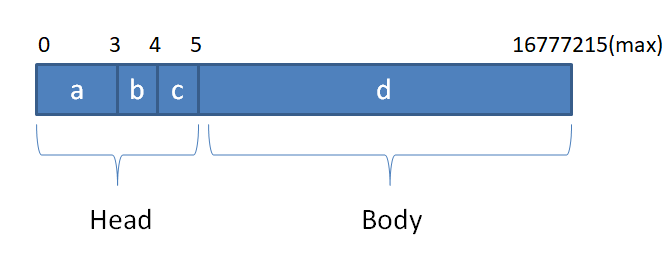

# TCP-Client-Server-Implementation

A C++ Tiny TCP client/server framework.

## Environment

Tested on:

- Linux 4.19.128
- gcc version 7.3.1

Required Packages:

- spdlog v1.9.2

## Tech

- Main-sub Reactor model:
    - Main Reactor listen the connection of the clients, while accept a new socket, select a sub reactor by round robin and send to it.
    - Sub Reactor manage the clients and solve the IO tasks of them.
- Multi-threads: one loop per thread with thread pool
- EventLoop: Epoll with level trigger and non-blocking IO
- Using spdlog to supply the log system.
- A timer based on minimum heap.

## Application layer protocol 

Each message is packed in following standard:

a : the length of the package
b : the type of the message
- 0 : heartbeat package
- 1 : common message

c : Check Code
- the xor sum of all the bytes of the package

d : the message's context

## Heartbeat and reconnection

Heartbeat message is sent every 5 seconds, disconnected when 3 heartbeat messages are lost.

While the client lost the connection to the server, it will try to reconnect, the interval of reconnection can be set by users.

## Benchmark

The tests are designed in three groups:

- Group1: Single Client with sending messages one by one
- Group2: Single Client with sending messages bursting out
- Group3: Multi Clients with sending messages bursting out

Each group has following steps:

- Connection
- Warmup: send some messages but do not care it's performance.
- Test 
    - For non-bursting group, focus on the round trip time of a certain message with different payload sizes.
    - For bursting group, focus on the total time of sending lots of messages and get the reply of them.

For each group, the Server reply the same message to the Client(which means with the same payload size).

Measure: QPS, throughput, round trip time.

Result:

### Group 1

| payload size | max     | min    | avg      |
| ------------ | ------- | ------ | -------- |
| 1            | 0.0778  | 0.0086 | 0.010426 |
| 10           | 0.0658  | 0.0084 | 0.012768 |
| 100          | 0.095   | 0.0102 | 0.020059 |
| 1000         | 0.0955  | 0.0186 | 0.026374 |
| 10000        | 1.392   | 0.099  | 0.139785 |
| 100000       | 10.0772 | 0.9037 |  1.24298 |
| 1000000      | 91.776  | 9.0502 |  11.5824 |

Where the max, min, avg are all round trip time in millisecond.

The 1/2 round trip time should be divided by 2.

The throughput is about 91 Mbps, for the minimum payload size, the QPS is about 200000

The test code is ``test/Group1.cpp``

### Group 2

| payload size | max     | min     | avg     |
| ------------ | ------- | ------- | ------- |
| 1            | 40.3523 | 0.0207  | 33.0672 |
| 10           | 50.0205 | 0.017   | 41.4878 |
| 100          | 49.8232 | 0.0627  | 46.2818 |
| 1000         | 49.5511 | 0.005   | 13.864  |
| 10000        | 48.848  | 1.4594  | 7.89457 |
| 100000       | 75.8771 | 13.0286 | 42.8353 |
| 1000000      | 721.849 | 82.7039 | 431.669 |

While there are many messages at the same time, the performance became a bit astable.

However, the server still get the correct message.

The test code is ``test/Group2.cpp``

### Group 3

To avoid the influence of bandwidth, all the messages are `hi`, which is very short. 

| number of clients | number of Queries for one client | time(ms) | QPS    |
| ----------------- | -------------------------------- | -------- | ------ |
| 5                 | 10000                            | 99.5748  | 202020 |
| 5                 | 100000                           | 689.449  | 290274 |
| 10                | 100000                           | 1331.97  | 150262 |

The test code is ``test/Group3.cpp``
